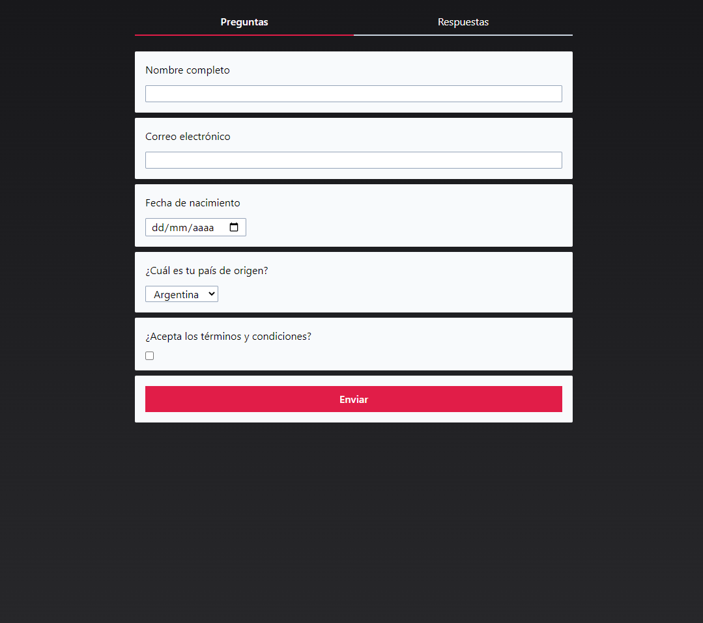
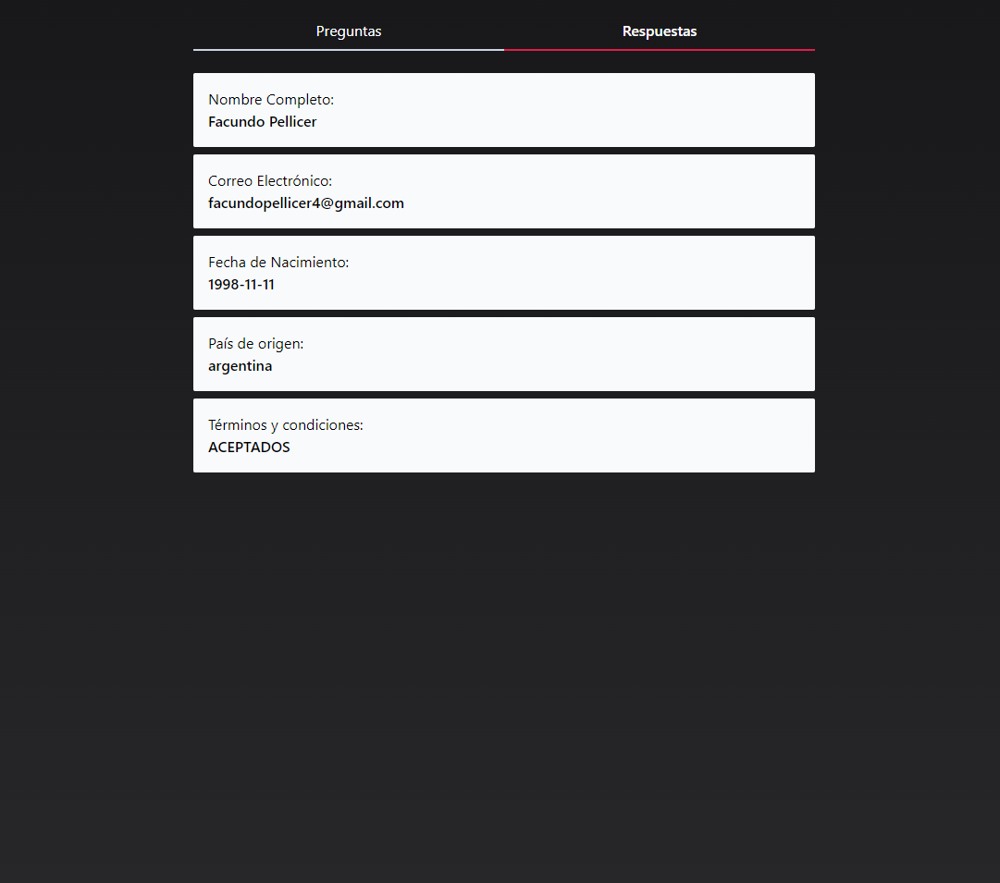

# Greydive Challenge

## Descripción

Challenge desarrollado para Greydive. Consiste en realizar una app en React.js que lea un archivo JSON y genere una app de encuesta. Las respuestas deben ser enviadas a una base de datos de Firebase.

## Tecnologías usadas

- React
- Firebase, Firestore
- Tailwind
- React
- React Router

## Presentación y funcionalidades

### Preguntas y Respuestas

